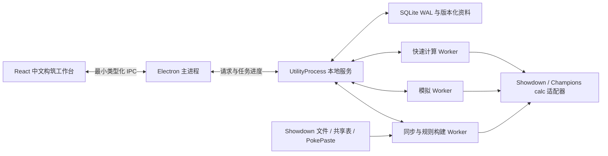

# 架构与算法

## 运行边界

应用采用 Electron 44、React 19、TypeScript、Vite、SQLite 和 pnpm workspace。渲染器关闭 Node 集成，开启上下文隔离与 sandbox，只能调用 preload 暴露的接口。输入在服务边界通过 Zod 校验；数据库写入均使用绑定参数。

Electron 主进程只处理窗口、文件对话框、外部链接、关闭保存握手和消息转发。UtilityProcess 是 SQLite 的单一写入者；三个计算线程分别处理快速分析、深入模拟和资料维护，避免长模拟占用快速编辑通路。线程只读取已经提交的数据库记录。故障会返回界面并写入本地 `errors.log`。

## 代码地图

| 目录或模块 | 职责 |
|---|---|
| `apps/desktop/renderer/src` | 工作台、目录搜索、成员编辑、对照预览、速度/伤害、笔记、模拟、环境与队伍库 |
| `apps/desktop/main/index.ts`、`preload.ts` | 桌面窗口与最小 IPC |
| `apps/desktop/main/service.ts` | 应用用例、任务状态、保存、候选环境安装与激活 |
| `apps/desktop/main/pool.ts`、`compute-worker.ts` | 三条计算通路与可取消任务 |
| `packages/core/types.ts`、`domain.ts`、`schema.ts` | 领域对象、内容指纹、锁定、修订号与输入验证 |
| `packages/core/storage.ts`、`context.ts` | SQLite、引擎/语料/模型版本、缓存上下文 |
| `packages/core/sources` | 下载/本地编译、表头识别、PokePaste、重校验与来源追踪 |
| `packages/core/battle` | Dex/Validator/calc 适配、真实回合模拟、可见信息、行动搜索 |
| `packages/core/analysis` | 聚类、配置后验、双打关系、快速评价、构筑搜索、配点与速度阈值 |
| `tools` | 可重复的数据构建、开发/打包和算法对照 |
| `tests` | 真实规则、逻辑、SQLite、模拟与 Electron 流程验证 |

分析函数依赖显式传入的引擎和模型，不读取组件状态或窗口。上下游规则访问集中在 `BattleEngine`；前端不另写能力值或速度公式。

## 数据与版本

`EnvironmentSnapshot` 保存 format ID、Showdown 提交或本地内容哈希、calc 提交、规则哈希、合法初始物种、配点预算和选出人数。编译产物按内容寻址存入 `engines/<id>`；候选构建使用目标磁盘内的临时目录，完成后原子安装。

SQLite 保存 `environments`、`corpora`、`models`、`drafts`、`history`、`analysis_cache`、`jobs`、`research_entries`、`source_registry` 和元数据。队伍保存与历史记录在同一事务完成。同一修订号不能对应不同内容，旧修订不能覆盖新修订。

队伍包含独立成员 ID、初始物种/特性、完整或部分配置、字段锁、来源 ID、笔记和环境 ID。Mega 不会在存储层替换初始特性；由计算条件或实际战斗决定使用哪个形态。

队伍的 `revision` 记录所有保存，`analysisRevision` 仅记录配置、字段锁与环境变化。名称与笔记编辑不使仍有效的计算过期。分析与提案绑定队伍 ID、计算内容指纹、计算修订号、环境、语料、模型和算法版本。应用提案时服务端复核这些绑定与所有锁，再检查合法性；客户端也复核异步返回期间队伍是否已切换或修改。

队伍的重启恢复、历史版本和分析任务留在本地。重放模拟会读取原语料与模型；如果算法实现版本已经变化，明确拒绝用新算法冒充原版本重放。

Champions 图片由 `tools/sync-sprites.ts` 从固定的公开仓库提交构建，按完整物种和形态 ID 查询，不按全国图鉴编号截取小图。`assets/pokemon/manifest.json` 保存来源、尺寸和内容哈希；来源与映射共同决定素材版本。376 条映射包含当前初始形态、Mega 和雌性炎狮；雌雄爱管侍、超能妙喵、幽尾玄鱼分别匹配。图片随包离线使用，新形态缺图时显示“待补图”。

算法升级时，服务先检查环境关联模型的算法版本。同环境、同语料有新版随包模型时直接安装；自定义语料由维护线程重建。启动页或工作台显示进度并可取消，取消不安装未完成结果。旧模型保留，计算上下文不能用旧模型执行新算法。相同环境、相同来源内容再次同步时复用已有模型。

## 规则接入

初始规则为 `gen9championsvgc2026regmc`。Showdown `Dex.forFormat` 解析 mod 继承和学习表，`TeamValidator` 处理物种/道具条款及禁限规则。Champions 配点原样传入 `EVs` 字段；未写配点保持未知，不从普通 EV 数值推断或压缩。

Showdown 文本导入器在缺少 `Level:` 时默认填 100，本应用改用该格式的等级规则。显式填写的等级保留供校验，实际回合通过 `adjustLevel` 使用格式规定的等级。因此规则验证、Champions calc 和 Showdown 实战不会使用不同等级。

Champions calc 使用 generation 0。物种、招式、道具、特性、性格和相性表从同一 Dex 覆盖到其 adaptable 数据接口。数值/名单更新无需重写前端；机制变化仍需代码适配和回归用例。单项 32 点属于当前 Champions 适配边界，改变后必须更新适配器，不能静默继续计算。

## 来源处理

分表标题与赛季对应，表头按集中维护的别名识别，元数据缺列显式记录。PokePaste 保存原始文本、日期、作者、说明、赛事、名次和发布链接。相同配置按规范化指纹归组，保留每次转贴的来源。招式、道具、性格或配点不同的队伍保留为不同观察。

每条观察记录已知字段和目标环境合法性。所有历史观察在目标环境下重校验。当前频率和共现只读取当前赛季；历史资料通过配置先验参与后验，也可作为明确标注来源的推荐候选。赛事名次没有被转换为胜率。

`analysis/evidence.ts` 统一配置供应与赛季参考规则。某物种的当前完整独立观察数少于 `max(1, priorStrength)` 且有合法历史配置时，浏览器默认显示历史参考；用户可关闭。这里的阈值复用模型拟合的先验强度，不改变统计频率或后验权重。推荐偏好可排除仅见于历史的候选，锁定物种的替换也遵守该设置；保留项与开关冲突时明确报告。该开关筛选候选，不停用模型的历史先验。

批量重校验只读取一次目标环境快照，保留逐配置与整队的完整合法性检查。模型拟合复用相同的先验证据、参考速度、角色标签、medoid 成本和 bootstrap 切分；距离队列使用数值数组，保留原比较顺序及相同距离的处理。所有候选切分、八次 bootstrap 与内部时间校准仍执行，优化前后的持久化模型逐项对照。

快速对照尚无当前合法完整配置时，参考具有最近可解析日期的历史赛季。完整对手池尚无当前合法队伍时使用同一赛季选择方法，并允许关闭历史对手参考。若历史日期全部未知，明确列出所用赛季，不编造先后顺序。当前完整对手出现后优先使用当前来源；历史对手不混入当前频率。模拟结果保存实际参考赛季、来源数量和指定对手方式。

聚类与精算只使用完整合法配置。缺字段观察按已知招式、道具、特性和性格分配到兼容流派，按当前与历史支持度收缩；它们贡献已知字段证据，但不生成虚构配点，也不替换真实 medoid。合法性验证允许未知性格和特性拥有合法见证；见证值仅用于判断是否存在合法补全，不保存进观察或统计。

## 配置识别与推断

距离组合了招式 Jaccard、功能标签、道具、特性、性格、真实能力值和六个参考配置的速度/伤害阈值。权重分别表达配置字段的作用；未知数值不作为零参与距离。

配置按重复观察支持度赋权，进行加权平均链接层次聚类。候选切分来自树中最大的合并间隙；以加权轮廓系数、8 次 Poisson 权重重采样的一致性和复杂度惩罚选择切分。少于四个不同配置时保留观察，不作稳定流派结论。代表是实际观察中的加权 medoid，不拼接独立众数。

`configurationLibrary` 从流派的完整观察构建真实配置索引：同一流派内不同招式、配点、道具和特性均保留，各自绑定来源。当前快照有 8,885 份完整变体，其中 921 份具有当前赛季支持。medoid 用于流派概览；目录、保留项、配置推断、速度比较和模拟采样均可访问真实变体。配置 ID 由物种与完整配置指纹决定，原代表 ID 不变。

配置后验使用“历史流派 → 流派内真实变体”的分层 Dirichlet 先验；当前完整证据与兼容的缺字段证据更新到变体，队友条件向所在流派收缩。流派概率与道具/特性/招式概率都汇总同一个配置分布，温度只应用一次。历史强度和温度在隔离重复队伍、作者与原链接的时间留出上选择，训练不读取未来历史资料。记录 log loss、Brier、复原与置信度分箱；先验消融保留相同训练标签空间和显式未见类别。它是可解释的经验贝叶斯近似，当前评测没有整体优越性保证。

## 快速评价与搜索

评价单位是完整配置及其队友。引擎提供伤害乱数、命中条件下击杀概率、速度与场地响应；机制关系记录场地种子、天气、掩护、击掌奇袭、空间等配合和冲突。

`analysis/mechanisms.ts` 是浏览器和分析端共用的机制目录，按八类用途组织62项机制。配置条件与构筑功能分开：轻装等条件不会额外增加功能标签，多个控速手段共用同一功能。目录筛选贯穿物种、流派和真实变体，按当前形态表标记仅在指定 Mega 后获得的特性。`role-knowledge.ts` 使用当前规则校验招式、特性和道具，并列出每项的实际精算范围；详见 [机制目录与边界](MECHANISMS.md)。

快速目标包含最低乱数进攻压力、平均承伤、同优先度速度关系、覆盖和困难尾部。默认对照 24 个有合法观察支持的流派代表，以所用赛季的独立观察数加权。真实共享对手按公开物种名单归组，用队友条件后验投影到该矩阵，记录流派概率覆盖与缺失物种；每个流派仍只用代表配置计算，不是全部变体穷举。

构筑评分为每组对手分别枚举规则规定人数的选出与唯一 Mega 使用者。未选成员不贡献伤害、天气、场地或支援；Mega 后特性只属于该路线的进化者，相同机制关系去重。队伍诊断中的单只威胁使用一条明确的参考选出，推荐预览另列对手场景中的前后选出、Mega 与成立条件。评分不是选出胜率。

四人选出枚举每组全部六对首发，指定对手时按对方全部真实配置后验评价。结果绑定队伍计算修订、环境、语料、模型与对手列表，切换后不能保存旧路线。灭歌、复活、强化掩护、款待恢复满血减伤和空间内外模式分别说明依赖与条件。长回合资源价值仍需模拟与实战记录核验；作者未提供的实际选出不能用算法猜测补成事实。

模拟的队伍预览复用同一配置级选出与首发评价。假设库仅由公开物种、已公开队表、随机种子和采样数构建，不读取实际对手的隐藏配置。首发仅使用在场两人的天气、场地及分配给它们的 Mega；后排条件不能提前借用。伤害查询次数来自实际适配器调用，缓存复用不重复计数。

搜索默认筛选 48 个候选，束宽为 7，保留最多四个方案。候选来自全部真实配置，先保留用户指定变体与功能缺口，再按招式、道具和特性的功能签名保留差异，不再把每个物种固定限制为两份代表。用户可设置可见的软权重，合法性与锁不受这些权重改变。完整方案/改队搜索再执行双位置邻域搜索，处理单位置难以跨越的道具冲突，最终以 Pareto 与物种/配置差异选取结果。参数集中在 `QUICK_SEARCH`，属于性能与搜索质量的显式折中；不是穷举最优保证。

缺口计分及预留候选按用途组归并，机制细目增加不会线性增加覆盖分。搭档说明另以行动窗口、屏障、轮转、回复等资源键去重；多个描述或受益成员不会重复增加同一份资源。天气和场地已有数值对照，不再在最终支援分中重复奖励。该支援评价仍是启发式，未经实战标签证明为最优权重。

所有候选遵守物种、道具、学习表和用户锁。指定某个位置替换时，其余位置保持不变。字段约束拼合出的配置会标注算法生成，并重新校验。

搜索默认没有墙钟截止。显式传入 `timeBudgetMs` 时只返回预算内已成队的合法方案，并报告未完成层数和评估状态数；预算结束仍未成队则返回明确错误。同预算实验单列正在执行的评估与整理造成的超时，不将节点预算称作同时间实验。

配置与条件的伤害行重复使用；选出及队伍评分缓存限定在单次搜索内，并包含配置内容、成员顺序、目标和权重。场景投影通过弱引用关联选出，搜索结束后可回收。缓存不省略候选或机制，配点与权重变化另有一致性回归；实测耗时与尚未达到的目标见验证记录。

推荐解释来自同一组威胁的改动前后比较，展示发生变化的伤害、击杀概率、承伤与速度；没有收益时明确说明。精度不足、缺样本、无合法方案或约束冲突会返回错误。

## 配点与速度

配点优化固定性格、道具、特性与四招，按实际伤害枚举目标涉及的整数维度，再用前向约束检查和分支定界求最少点数。最终配置再次逐项验证目标与完整合法性。返回剩余点数，不会把未指定的目标偷偷设为必须满足。特殊招式的跨能力值依赖需要持续扩展；最终复核失败会显式中止。

速度页面复用 calc 的最终速度计算，包含能力等级、天气特性、场地、种子轻装、围巾、铁球、双方顺风与麻痹。空间改变行动先后，不把速度值本身显示成负数；同速保持随机结论。只比较同优先度，不能代替完整行动顺序。

## 深入模拟

引擎运行完整 Showdown 回合。封闭模式显式移除 Open Team Sheets；策略只接收己方请求、公开日志、对手物种和已经公开的信息。公开队表模式提供四招、特性、道具，不额外公开性格或配点。

训练从给定六只的条件后验采样合法联合配置，构建信息集 UCT 树，使用行动渐进展开。动作包括六选四、两个首发、换人、集火、保护、控速和 Mega。双方从同一行动前状态决定指令，再提交给引擎；不存在先读对方当前指令的策略接口。

默认将时间预算的 45% 用于训练，其余用于独立种子复评。复评使用进攻、控场、混合三种启发式对手；未见信息状态使用明确的策略 rollout。配对比较使用相同对手、随机种子和训练预算。固定场数模式不受墙钟预算截断，便于复现；取消与未结束对局单列。

结果包含训练/复评场数、胜负平、Wilson 区间、选出与首发分布、困难对手尾部、每场公开回放及双方的行动信息键。树报告访问分布、行动边数与复评复用。信息键保留精确 HP/PP、全部已知招式/道具/特性、己方配置、有效计时和绝对回合；后者受 Showdown 的真实判平规则影响。去除传输标识、已消失场地的时钟与在场成员的重复记录；换出重置的临时状态不留在后排键中。魔法镜反弹和临时调用与原配置招式分别记录，强制充能属于等待行动。

除默认混合策略外，可选择基于配置假设的伤害或支援策略，指定每次决策的配置采样数和对手策略。策略仅接收己方配置与公开观察；不能读取对手私有 Battle 对象。动作空间包含灭歌、复活和资源轮转，是否合理执行须核对真实回放。当前开发集没有整体优势，深层树复用有限，默认保持混合策略。失败返回随机种子、回合和公开日志，不能作为已完成胜负。

帮助的先验分值根据己方同时选择的另一行动计算，配合守住、换人或强制充能不会获得攻击加成。伤害重评分不为零伤害结果增加抢先击杀价值；被精神场地等机制挡住的击掌奇袭不再凭固定干扰奖励取得高分。这些修复仍是策略先验，不会删除可提交给 Showdown 的合法行动。

同一联合行动的两个己方位置共享计划 Mega 后的特性、天气与场地；不会提前读取对手本回合指令。公开天气协议 `Snowscape` 对应伤害库的 `Snow`。相关回归覆盖 Mega 灭歌、喷火龙 Y 与队友气象球、雪天物理减伤，但不将这些个案当作全部机制的策略认证。

## 更新维护原则

规则数值、引擎行为、分析算法和来源样本分开版本化。新增机制优先加入 `battle/verify.ts` 的 Showdown/calc 逐档对照，再接入快速分析与模拟策略。不要在前端复制战斗公式，也不要用跳过验证、补零或固定模板绕过失败。

完整更新操作、包内运行时和发布检查见 [ENVIRONMENT_UPDATES.md](ENVIRONMENT_UPDATES.md)。

## 研究记录与维护

结构化对局计划保存对手六只、多个选出与首发、赢法、担忧和验证状态。实战记录绑定当时完整队伍快照；修改当前队伍不会改写历史。成员选出频率仅以已知选出的记录为分母。来源意图、原作者、变体链和引文独立于频率统计，缺少说明时保持未知。

速度目标可以携带完整条件进入配点搜索。条件模板保存基准、对手流派和多个状态变化；结果逐个条件复核。风险比较通过真实 Showdown 命中事件计算天气、特性、道具与多段落空，合法替代招式重新校验；不包括畏缩等行动阻止、命中/闪避等级和接触反伤。画皮与结冻头的失效状态使用对应后续形态的能力值。

来源注册表按环境、共享表文档 ID 与 gid 区分。同步目标、全局默认环境和当前队伍环境分别显示。角色知识集中在 `analysis/role-knowledge.ts`，按环境计算内容版本，分别展示机制、适用限制和合法的招式/特性证据。

独立资料导入读取网页正文、X 公共 oEmbed 或手工原文；回放可读取 Showdown JSON/公开日志。准备阶段不保存。用户核对标题、作者、日期、采样口径、引文和自己的解读后保存；引文必须出现在原文中。回放胜负不进入共享构筑频率。

维护报告区分数据库内容字节、实际磁盘占用、进程堆与三个线程的模型/伤害缓存。清理需要用户选择与预览，仅删除可重算缓存或没有任何持久记录引用的模型/语料；引用关系变化时要求重新预览。数据库压缩后执行 WAL checkpoint，读取事务阻止日志回收时显示具体错误。环境、队伍历史、研究资料及原始来源默认保留，不承诺清缓存后 RSS 立即回落。
